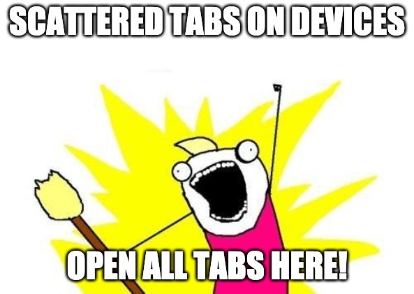

# Opens All Tabs!

A stupid simple Chrome extension 

#### What's dis? 😐

Transfers and Opens Tabs and windows from Chrome synced devices to your laptop.

###### Tell me more 🤨...

Is a super simple chrome extension which looks for synced devices (aka where you logged in as the same chrome user) and duplicates, per each device, all the tabs in one Chrome window.

##### Ok, but what's can I use it for? 🙄 

_Note:_ You must have multiple synced devices to use this app, otherwise, there is no point to even look for an extension like this

1. You have open tabs and windows on multiple __synced__ devices (for example multiple smartphone or multiple laptops)
1. You need a specific tab on your laptop or you want to consolidate all your tabs on your laptop because maybe you want to create a saved Tab's Session
1. and most importantly you don't want to copy URLs manually from your device to laptop

\>\> Enter **Opens All Tabs!**

##### How it works? 🤓

1. Download the extension from Chrome Web Store
1. Click on the extension icon
1. It will list all the tabs and windows from your synced devices and for each device it will open a new Chrome window with all the tabs of that device.

###### Why?

I usually keep open lots of tabs on my devices, I do so as I can go back to each tab later in the future or just read the content at my pace, additionally, I don't want all those Tabs to be saved in my Favorite list.
Some tabs are open just because I procrastinate reading them.

I like to read on my laptop, but what if I have 10 tabs open on my smartphone because I've left them open there while I was surfing the web on my way to work or meet friends?

`Opens All The Tabs` saves me tons of time by transfer all the open tabs on my laptop in one click!  

##### Todo 📝

- [ ] Show all synced device (with badge over icon)
- [ ] Choose from which synced device transfer the tabs
- [ ] Send multiple tabs between any two devices
- [ ] Create a Tab session with Save/Restore
- [ ] Add User options
- [ ] Improve code
- [ ] Improve UI
- [ ] Add Tests

###### Changelog 📗

- v0.0.1:
	- Just published a super easy-peasy pre-alpha version

##### Credits 🧩

- Icon made by <a href="https://www.flaticon.com/authors/itim2101" title="itim2101">itim2101</a> from <a href="https://www.flaticon.com/" title="Flaticon">www.flaticon.com</a>
