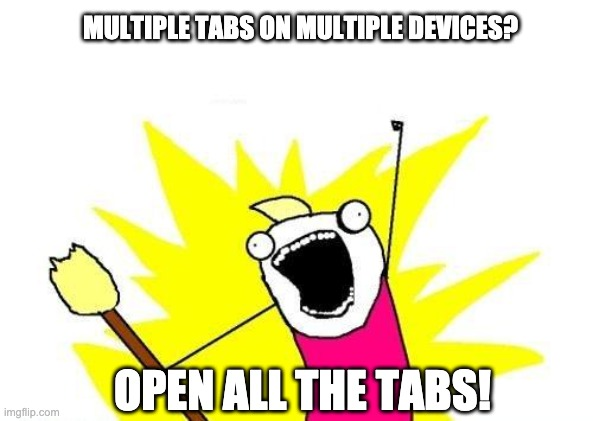
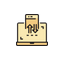

# Opens All Tabs!

A stupid simple Chrome extension 

#### What's 'dis'? 😐

Opens Tabs and Windows from Chrome synced devices to your laptop, in one click.

###### Tell me more 🤨...

It's a super simple chrome extension which looks for synced devices (where you logged in as the same chrome user) - for example, your smartphone or another laptop you own - and duplicates all the tabs in a new Chrome window on your laptop, one per device.

##### Ok, but what problem it solves? 🙄 

_Note:_ You must have multiple synced devices to use this app, otherwise, there is no point to even look for an extension like this

1. You have open tabs and windows on multiple __synced__ devices (for example multiple smartphone or multiple laptops)
1. You need a specific tab on your laptop, or you want to consolidate all your tabs on your laptop
1. ...and most importantly you don't want to copy URLs manually from your device to laptop or avoid using open tabs on your other devices

\>\> Enter:

##### How does it work? 🤓

1. Download the extension from Chrome Web Store, or clone this repository and load the Extension from Google Chrome Developer Mode 
1. Click on the extension icon: 
1. The extension will search all your synced devices for the tabs and window in the background 
1. For each device, it will open a new Chrome window on your laptop with all the tabs of that device.

###### Why?

Cause it solves mu procrastination-&-forget behaviour with multiple tabs on multiple devices.

I usually keep open lots of tabs on my devices, I do so as I can go back to each tab later and read the content at my pace. 
I keep multiple tabs open because sometimes content of tabs looks interesting but not enough to be saved in my Favorite list.

Some tabs are open just because I procrastinate reading them.

`Opens All The Tabs` saves me tons of time by transfer and searching all the open tabs on my laptop in one click! 

Tabs stay open on the original devices too, so it just a way to duplicate multiple sessions in the one on my laptop. 

##### Todo 📝

- [ ] Show all synced device (with badge over icon)
- [ ] Choose from which synced device transfer the tabs
- [ ] Send multiple tabs between any two devices
- [ ] Create a Tab session with Save/Restore
- [ ] Add User options
- [ ] Improve code
- [ ] Improve UI
- [ ] Add Tests

###### Changelog 📗

- v0.0.1:
	- Just published a super easy-peasy pre-alpha version

##### Credits 🧩

- Icon made by <a href="https://www.flaticon.com/authors/itim2101" title="itim2101">itim2101</a> from <a href="https://www.flaticon.com/" title="Flaticon">www.flaticon.com</a>

